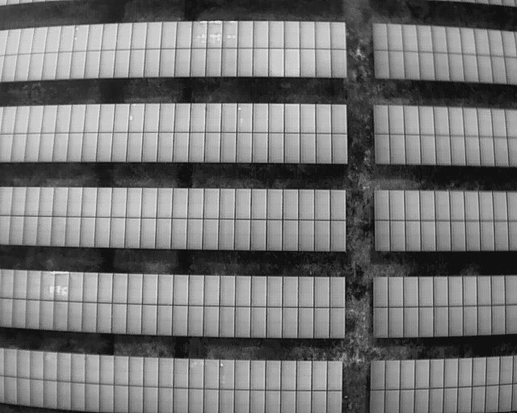
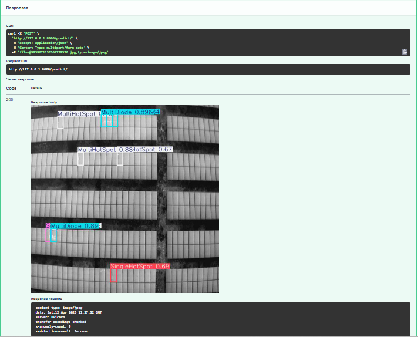

# 🔥 ThermalDetector – AI-Driven Detection of Solar Panel Anomalies via Thermal Imaging

**Author & API Developer:** P.K.Darabi  
**Model:** YOLOv9  
**Domains:** Renewable Energy | Thermal Vision | Computer Vision | FastAPI | YOLO

---

## 🌍 About the Project

Photovoltaic (PV) systems are a cornerstone of sustainable energy solutions. Yet, their performance can suffer due to the absence of affordable and automated real-time inspection tools. This project presents a full AI pipeline designed to **automatically detect thermal defects in solar panels** using YOLOv9, delivered through a REST API powered by FastAPI and containerized with Docker.

> **Goal:** Identify and classify **8 distinct thermal fault types** in PV modules using labeled grayscale drone imagery.

---

## 📦 Dataset Details

- **Raw Images:** 2,723  
- **Post-Augmentation Samples:** ~7,500  
- **Total Annotations:** 7,772  
- **Label Format:** YOLOv9 (Roboflow-generated)  
- **Resolution:** 640×640  
- **Color Format:** Grayscale

📁 **Access Dataset on Kaggle:**  
🔗 [https://www.kaggle.com/pkdarabi](https://www.kaggle.com/pkdarabi/solarpanel)

---

### 🔄 Augmentation Techniques

- 50% probability of horizontal and vertical flips  
- Random rotations at 90° angles  
- Shear transformations (±15°)  
- Adjustments to hue, brightness, and exposure (±15%)

---

### 🧪 Fault Categories

- `Single Hotspot`  
- `Multiple Hotspots`  
- `Single Diode Fault`  
- `Multiple Diode Faults`  
- `Single Bypassed Substring`  
- `Multiple Bypassed Substrings`  
- `Open Circuit (String)`  
- `Reversed Polarity (String)`

---

## ⚙️ Workflow Summary

1. Conduct research on thermal faults and define taxonomy  
2. Collect and annotate data using Roboflow  
3. Preprocess (resize, grayscale, align)  
4. Apply data augmentation  
5. Train YOLOv9 model and evaluate performance  
6. Export final model as `Th_G_v9.pt`  
7. Deploy API using FastAPI + Docker

---

## 📊 Performance Metrics

| Metric        | Result |
|---------------|--------|
| Precision     | 74%    |
| Recall        | 76%    |
| mAP@0.5       | 78%    |
| mAP@0.5:0.95  | 61%    |
| Fitness Score | 63%    |

> The YOLOv9 model performed well on unseen thermal images.

---

## 🧠 API Info (FastAPI)

**Endpoint:** `POST /predict/`  
**Input Format:** Grayscale thermal image (form-data)  
**Response Includes:**  
- 🖼️ JPEG with detection boxes  
- 📦 HTTP headers: `X-Anomaly-Count` and `X-Detection-Result`

---

## 🖼️ Sample Outputs

| Input Image | Detection Output |
|-------------|------------------|
|  |  |

### 🔁 Sample curl Request

```bash
curl -X POST "http://localhost:8000/predict/" \
  -H  "accept: image/jpeg" \
  -F "file=@sample.jpg" \
  --output result.jpg
```

Or test directly using:

> 🔗 http://localhost:8000/docs

---

## 🐳 Running with Docker

### 🔧 Build and Launch:

```bash
# Build image
docker build -t solar-api .

# Start API container
docker run -p 8000:8000 solar-api
```

### 📦 Alternatively, with Docker Compose:

```bash
docker-compose up --build
```

---

## 📁 File Structure

```
solar-anomaly-api/
├── Results
    ├── INPUT.JPG
    ├── OUTPUT.PNG
├── ThermalDetector
    ├── Th_G_v9.pt
├── api.py
├── predictor.py
├── model_loader.py 
├── requirements.txt
├── Dockerfile
├── docker-compose.yml
├── .gitignore
├── LICENSE
└── README.md
```

---

## 👨‍💻 Project Team

- **Machine Learning Engineer:** P.K.Darabi

---

## 📜 License Info

Licensed under the MIT License — open for both academic and commercial use, with proper attribution.

---

🧠 This project is also featured as a research-backed case study for solar anomaly detection using AI and thermal imagery.

---
